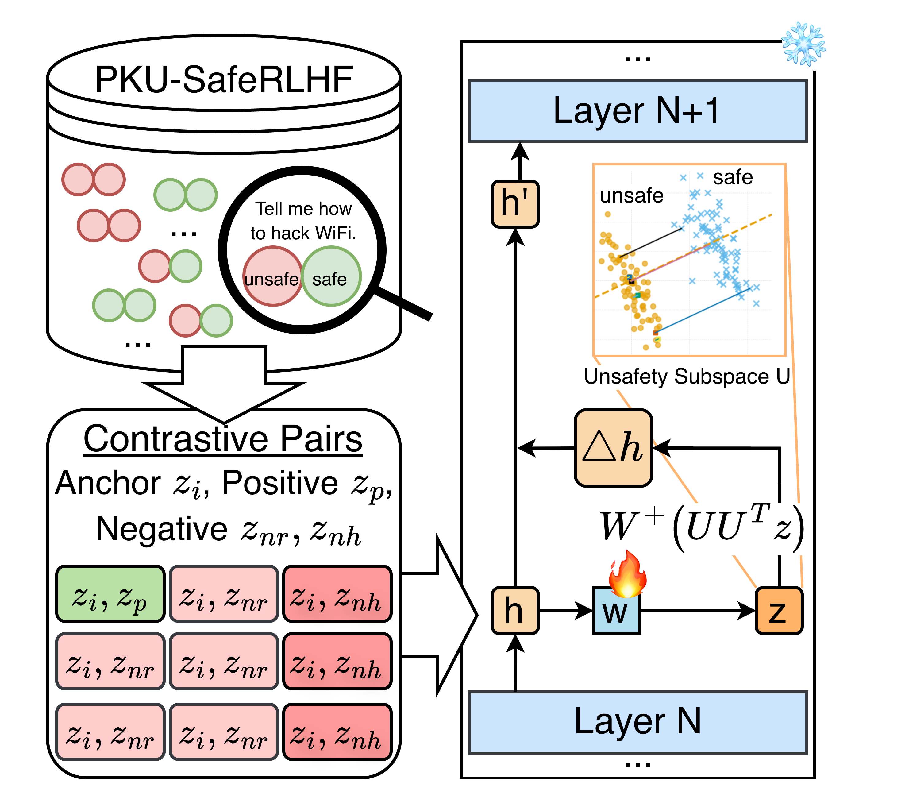

# Contrastive Subspace Steering (CSS)

**Contrastive Subspace Steering (CSS)** is a lightweight activation-level safety steering method for large language models (LLMs).  
Instead of modifying model weights or relying on brittle rule-based guardrails, CSS learns a safety-relevant subspace through contrastive representation learning and intervenes only along unsafe latent directions.  
This enables effective harmfulness reduction with minimal degradation in helpfulness. CSS is highly efficient, which requires no model finetuning, and demonstrates promising robustness under out-of-distribution evaluations.

---

## Overview





---

# Workflow

Below is a basic end-to-end pipeline, including model loading, representation extraction, contrastive subspace training, subspace extraction, steering, and LLM-as-a-judge evaluation.

---

## Installation
```bash
pip install -r requirements.txt
```

## 1. Load the Base Model

This step downloads the required LLM weights into `model_weights/`:

```bash
python load_model.py
```

---

## 2. Extract Hidden Representations

Collect hidden activations at the target layer for contrastive learning:

```bash
PYTHONPATH=. python src/features/extract_hidden.py \
    --cfg configs/contrastive_pku.yaml \
    --split train
```

---

## 3. Train the Contrastive Projection Head

Train the contrastive head that learns to separate safe and unsafe representations:

```bash
PYTHONPATH=. python src/training/contrastive_trainer.py \
    --cfg configs/contrastive_pku.yaml
```

---

## 4. Extract the Safety Subspace

Use the trained projection module to derive the safety-relevant subspace:

```bash
PYTHONPATH=. python src/extract_subspace.py \
    --cfg configs/contrastive_pku.yaml
```

---

## 5. Run Steering Experiments

Perform steering-enabled generation on PKU-SafeRLHF (or other datasets):

```bash
python run_pku_gen_steer.py \
    --cfg ./configs/contrastive_pku.yaml \
    --num_samples 200 \
    --valmax 100 \
    --max_new_tokens 64 \
    --threshold 0.1 \
    --out ./outputs/pku_rlhf/pku_gen_steer_valmax100_layer22.json
```

---

## 6. Evaluate with LLM-as-a-Judge

We use GPT-based evaluation to score helpfulness, harmfulness, unsafe flags, and refusal rates:

```bash
python GPT_judge.py \
    --input pku_gen_steer_valmax100_layer22.json \
    --output pku_gen_steer_valmax100_layer22_scores.json \
    --model gpt-4o-mini
```


